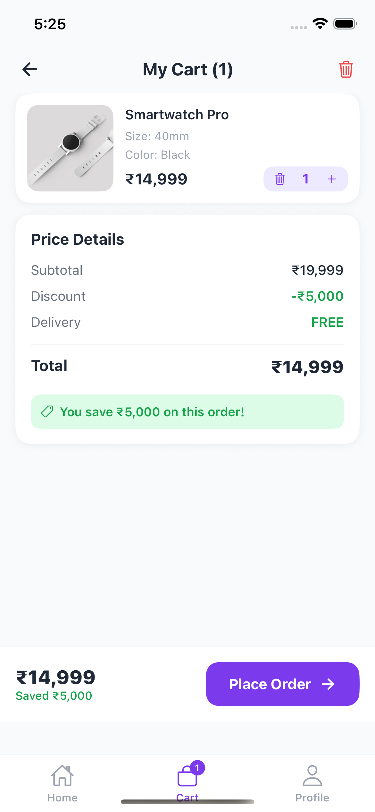
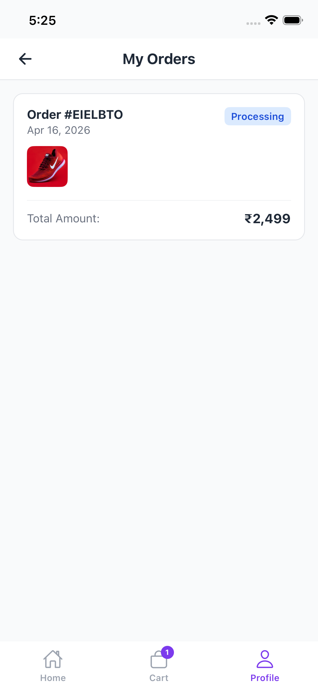
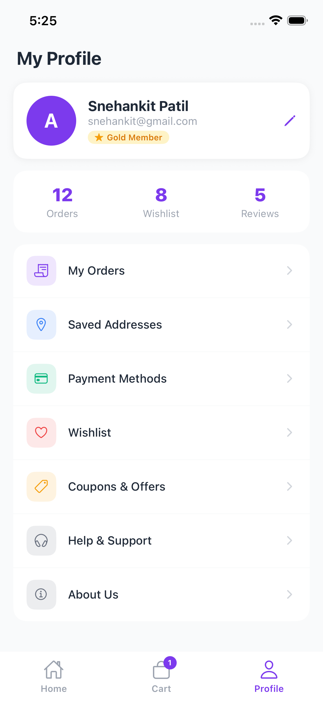
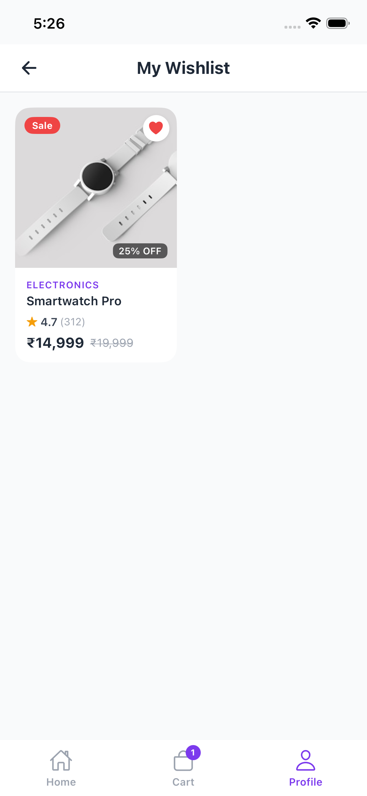

A mobile e-commerce application built using React Native and Expo.

## Features
- Product listing with categories  
- Search functionality  
- Product details screen  
- Cart management  
- Profile screen  

## Tech Stack
- React Native (Expo)
- React Navigation
- Context API

## Run Locally
```bash
npm install
npx expo start


## Screenshots






=======
